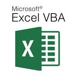
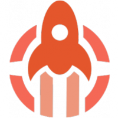

<h1>Hi there, I'm Marco - aka Maggo 👋</h1>

<h2>About me</h2>

  👨‍💼 I am a graduate business informatics specialist with extensive programming experience since 2003. My passion is the development of software solutions and the optimization of business processes.

  👨‍💻 Currently I am working as a team leader and have shifted my focus to the organization and coordination of a development team. I enjoy using my technical skills and leadership qualities to lead challenging projects to success.

  💼 My broad expertise includes various technologies and programming languages. I have extensive experience in working with agile methods and implementing projects in multidisciplinary teams.

  🌐 In my spare time I like to dedicate myself to learning new technologies and sharing my knowledge with the developer community.

  📝 If you are interested in further information, please do not hesitate to contact me. Just contact me at my e-mail address.

  🛠️ Here you will find an overview of the technologies and tools I work with.

---

<h2>Technologies</h2>

<table>
  <thead>
    <tr>
      <th>Logo</th>
      <th>Name</th>
      <th>Description</th>
    </tr>
  </thead>
  <tbody>
    <tr>
      <td align="center">
        
      </td>
      <td>PHP</td>
      <td>PHP is a popular general-purpose scripting language that is especially suited to web development.</td>
    </tr>
    <tr>
      <td align="center">
        
      </td>
      <td>Laravel</td>
      <td>PHP-Framework for web applications</td>
    </tr>
    <tr>
      <td align="center">
        
      </td>
      <td>JavaScript</td>
      <td>Programming language for web applications</td>
    </tr>
    <tr>
      <td align="center">
        
      </td>
      <td>Nuxt.js</td>
      <td>JavaScript-Framework for Vue.js-applications</td>
    </tr>
    <tr>
      <td align="center">
        
      </td>
      <td>Inertia.js</td>
      <td>JavaScript-Framework for Laravel-applications</td>
    </tr>
    <tr>
      <td align="center">
        
      </td>
      <td>Python</td>
      <td>Programming language for web applications</td>
    </tr>
    <tr>
      <td align="center">
        
      </td>
      <td>MySQL</td>
      <td>Relational database management system</td>
    </tr>
    <tr>
      <td align="center">
        
      </td>
      <td>Redis</td>
      <td>In-memory data structure store</td>
    </tr>
    <tr>
      <td align="center">
        
      </td>
      <td>SQLite</td>
      <td>Relational database management system</td>
    </tr>
    <tr>
      <td align="center">
        
      </td>
      <td>Git</td>
      <td>Version control system</td>
    </tr>
    <tr>
      <td align="center">
        
        </td>
        <td>RESTful APIs</td>
        <td>Application programming interface that uses HTTP requests to GET, PUT, POST and DELETE data</td>
    </tr>
    <tr>
      <td align="center">
        
      </td>
      <td>Pusher</td>
      <td>Service for real-time communication</td>
    </tr>
    <tr>
      <td align="center">
        
      </td>
      <td>VBA</td>
      <td>Programming language for Microsoft Office applications</td>
    </tr>
  </tbody>
</table>

---

<h2>Tools</h2>

<table>
  <thead>
    <tr>
      <th>Logo</th>
      <th>Name</th>
      <th>Description</th>
    </tr>
  </thead>
  <tbody>
    <tr>
      <td></td>
      <td>Docker</td>
      <td>A set of platform as a service products that use OS-level virtualization to deliver software in packages called containers.</td>
    </tr>
    <tr>
      <td></td>
      <td>Visual Studio Code</td>
      <td>A source-code editor developed by Microsoft for Windows, Linux and macOS.</td>
    </tr>
    <tr>
      <td></td>
      <td>Terminal</td>
      <td>A terminal emulator included in macOS by Apple.</td>
    </tr>
    <tr>
      <td></td>
      <td>Jira</td>
      <td>A proprietary issue tracking product developed by Atlassian that allows bug tracking and agile project management.</td>
    </tr>
    <tr>
      <td></td>
      <td>Atlassian</td>
      <td>A company that develops products for software developers, project managers, and content management.</td>
    </tr>
    <tr>
      <td></td>
      <td>Forge</td>
      <td>A tool for continuous deployment of web applications.</td>
    </tr>
    <tr>
      <td></td>
      <td>Envoyer</td>
      <td>A tool for zero-downtime deployment of PHP applications.</td>
    </tr>
    <tr>
      <td rowspan="7" >
        
      </td>
      <td></td>
      <td></td>
    </tr>
    <tr>
        <td> ECC</td>
        <td>
          Amazon Elastic Compute Cloud (Amazon EC2) is a web service that provides secure, resizable compute capacity in the cloud.
        </td>
    </tr>
    <tr>
      <td> S3</td>
      <td>
          Amazon Simple Storage Service (Amazon S3) is an object storage service that offers industry-leading scalability, data availability, security, and performance.
      </td>
    </tr>
    <tr>
      <td> RDS</td>
      <td>
        Amazon Relational Database Service (Amazon RDS) makes it easy to set up, operate, and scale a relational database in the cloud.
      </td>
    </tr>
    <tr>
      <td> EC</td>
        <td>
          Amazon ElastiCache is a web service that makes it easy to deploy, operate, and scale an in-memory data store or cache in the cloud.
        </td>
    </tr>
    <tr>
      <td> Lambda</td>
      <td>
        Amazon Lambda lets you run code without provisioning or managing servers. You pay only for the compute time you   consume.
      </td>
    </tr>
    <tr>
      <td> SQS</td>
      <td>
        Amazon Simple Queue Service (Amazon SQS) is a fully managed message queuing service that enables you to decouple and scale microservices, distributed systems, and serverless applications.
      </td>
    </tr>
  </tbody>
</table>
